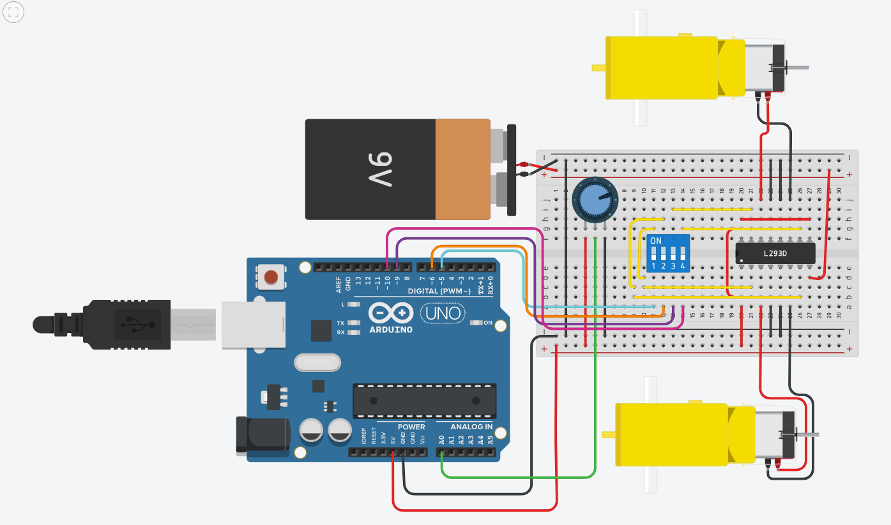
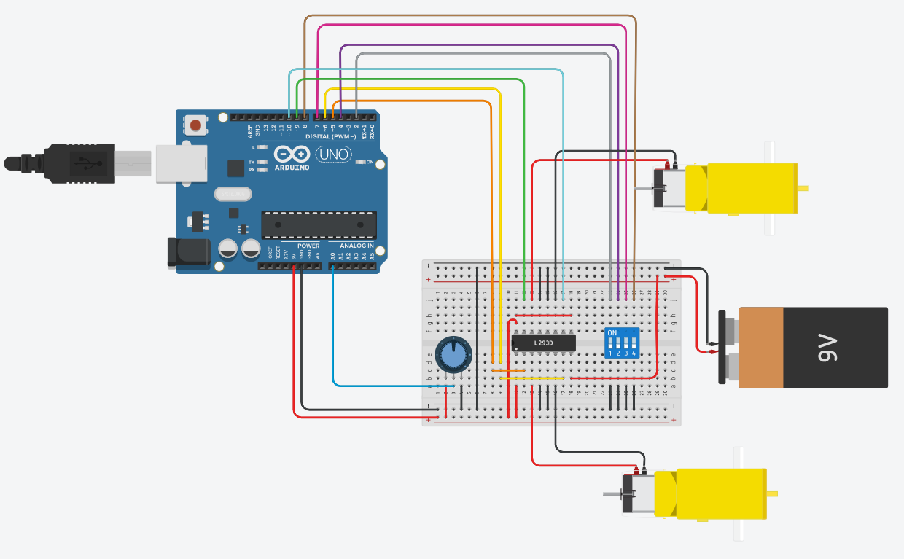

# R3-SoftwareTraining - Leslie Kocsis
## Intro:
This is my submission for Ryerson's 2020 R3 club Software training 1. The task is to use all the allowed circuit components with an arduino board to control two motors. The control system uses the following components: 
- potentiometer
- arduino 
- dip switch
- L293D motor controller chip  
- External Power Source

## Progress:
To implment the requirements I went through two designs. The first design implemented all of the features required including the dipswitch control. However, I misread the task pdf and thought that I needed to only use the dip switch to control the motors. I had read later on that it should not be switch controls the voltages for the chip, but the arduino should. For my first design, I had the PWM signal output go directly into the dip switch which went directly into the L293D chip. This did give the desired results of motor control, yet it was inadequte because the switches had to be switched on in a specific pattern depending on the wiring. 

First Circuit Design: 

Thus, I decided that the arduino should be programmed to control the state of the motors depending on which number on the dip switch is flicked. This would provide a more comprehensible and usable approach than relying on specific switch patterns due to the control being hard wired. Therefore, I placed the dipswitch pins as pullup inputs for the arduino. I put a conditional for all four pins to dictate the states of the motors depending if a specific switch is toggled which made the design a lot more usuable.

Final Circuit Design:

## Arduino Code: 
The Arduino chip has 5 inputs and 4 output pins. Its inputs include the analog pin A0 and the digital input pins 2,4,7 and 8. The code uses the analog pin to read the resistance on the potentiometer. It does this by using the map function takes the analog reading and converts it to the correct resolution of values that the PWM uses to output. Pins 2,4,7 and 8 are defined as pullup pins that use the dip switch. If the switch is closed, the digital reading on the pin equates to LOW and the opposite happens if the switch is open. This is how the arduino controls the state of the motors. The outputs are the Pulse-Width-Modulation pins 5,6,9 and 10. These pins take the reading from converted analog signal A0 and outputs a voltage from 0-5V depending on the analog signal of the potentiometer which control the speed of the motors. Lastly, the code uses nested ifs to go through all the dip conditionals and chooses each state function accordingly. If switch 1 is toggled, the motors go fowards. Switch 2 - backwards; 3 - left; 4 - right. Any other option or combination is considered OFF. 

## Design Problems: 
At first I had no idea what the potentiometer was used for. I figured that it was not need since you can just code the arduino using the PWM for the speed control. I did not realize that the Analog to Digital pins could be used as input readings to make the control design more intuitive. In addition, I misinterpreted the use of the dip switches. I thought that the PWM pins could just be wired into the dip switch and I could just use the dip switch itself to control the states of the motor. I then figured out after my first design iterration that this was a major flaw because the user would have to either know the wiring to the L293D chip, or must go through all 16 possible switch combinations to find out what's left, forward, right and reverse is. I decided in the end to rework my design to have the dip control to be simplified. 
